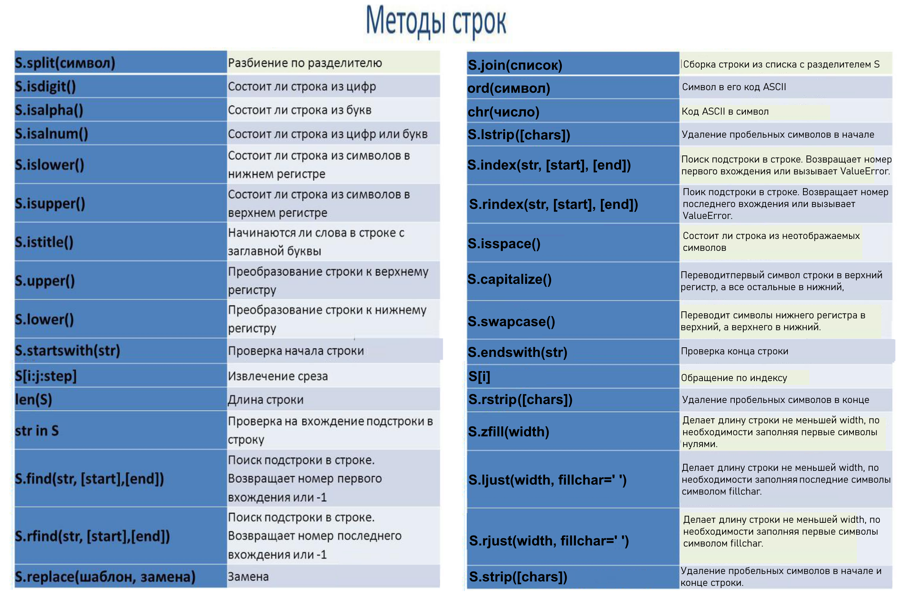
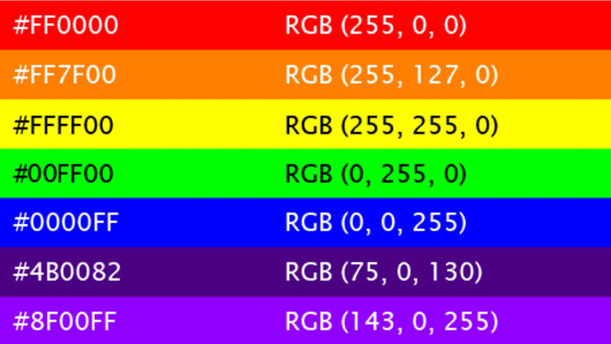
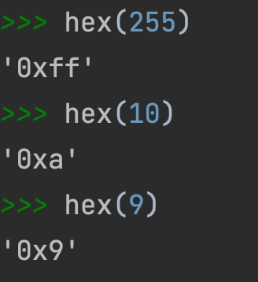

# Учебные задания по Python V7 String and Method


## Внимание начиная с этого задания все репозитариии будут приватными.
Для клонирования в случае остуствия доступа используйте команду:
**git clone https://ваш токен@ссылка на ваш репозиторий**

Выполните следующие задания. Решения для каждого задания пишите в отдельном файле в папке `tasks/`.

---

## Задание 1.
В файле `tasks/task1.py`

На вход программе поступает строка, ваша задача — удалить из нее все символы w и z.

Учитываем только маленькие буквы.

```
Sample Input 1:
what's up?

Sample Output 1:
hat's up?

Sample Input 2:
i love zoo

Sample Output 2:
i love oo
```
---

## Задание 2. 
В файле `tasks/task2.py` 

Петя записался в кружок по программированию. На первом занятии Пете задали написать простую программу. Программа должна делать следующее: в заданной строке, которая состоит из прописных и строчных латинских букв, она:

- удаляет все гласные буквы,
- перед каждой согласной буквой ставит символ ".",
- все прописные согласные буквы заменяет на строчные.
Гласными буквами считаются буквы A, O, Y, E, U, I, а согласными — все остальные. На вход программе подается ровно одна строка, она должна вернуть результат в виде одной строки, получившейся после обработки.
```
Sample Input 1:            Sample Input 4:      
Codeforces                      baa

Sample Output 1:            Sample Output 4:
.c.d.f.r.c.s                    .b

Sample Input 2:             Sample Input 5:
g                               aab

Sample Output 2:            Sample Output 5:
.g                                .b  

Sample Input 3:
Ba

Sample Output 3:
.b
```
---

## Задание 3.
В файле `tasks/task3.py` 

Напишите программу, которая проверяет, что введенная фраза s одновременно начинается со строки prefix и заканчивается строкой postfix.

***Входные данные***

В отдельных строках вводятся три значения: сперва строка s, затем строка prefix и потом postfix.

***Выходные данные***

Нужно вывести True, если введенная строка s одновременно начинается со строки prefix и заканчивается строкой postfix . Во всех остальных случаях нужно вывести False. Регистр букв нужно учитывать.

```
Sample Input 1:
translate russian to english
translate
english

Sample Output 1:
True

Sample Input 2:
translate russian to english
translate
SH

Sample Output 2:
False

Sample Input 3:
TRanSlate russian to english
TRa
lish

Sample Output 3:
True
```
---

## Задание 4.
В файле `tasks/task4.py` 

При помощи метода .center дополните введенную строку до 15 символов. В качестве параметра fillchar возьмите нижнее подчеркивание _

```
Sample Input 1:
Макгрегор

Sample Output 1:
___Макгрегор___

Sample Input 2:
Конор

Sample Output 2:
_____Конор_____

Sample Input 3:
Дженнифер Лопес

Sample Output 3:
Дженнифер Лопес
```
---
## Задание 5.

В файле `tasks/task5.py` 

На вход программе поступает натуральное число, которое не превосходит значение $10^9$.

Ваша задача — вывести данное число так, чтобы вывод занимал 10 разрядов. Если у числа не хватает разрядов, необходимо добавить вперед незначащие нули.

```
Sample Input 1:
99

Sample Output 1:
0000000099

Sample Input 2:
6873621

Sample Output 2:
0006873621

Sample Input 3:
321423

Sample Output 3:
0000321423
```
## Задание 6.

В файле `tasks/task6.py` 

Напишите программу, которая проверяет состоит ли введенная строка целиком из заглавных букв

В качестве ответа необходимо вывести True, если условие выполняется, во всех остальных случаях нужно вывести False.
```
Sample Input 1:
ABRACADABRA

Sample Output 1:
True

Sample Input 2:
This Good

Sample Output 2:
False

Sample Input 3:
QWeRTY

Sample Output 3:
False
```
## Задание 7.

В файле `tasks/task7.py` 

Вводится строка, которая может быть окружена символами -, _, !, ?.

Ваша задача — убрать все символы -, _, !, ? справа от строки и вывести полученный результат.
```
Sample Input 1:
-----Hello----

Sample Output 1:
-----Hello

Sample Input 2:
!!!World?????????

Sample Output 2:
!!!World

Sample Input 3:
___________Зачет!!!!!!!!

Sample Output 3:
___________Зачет
```
## Задание 8.

В файле `tasks/task8.py` 

         **Модель кодирования RGB**

Одним из способов кодирования цвета является метод RGB. В нём каждый цвет кодируется значениями базовых цветов: Red (красный), Green (зелёный) и Blue (голубой). Это три оси цвета, которые имеют градацию значений от 0 до 255. Если все три значения сделать нулевыми, то получится чёрный цвет, а если 255 — белый.

Каждый цвет в модели RGB записывается следующим образом:
```
#RRGGBB
```
Данный код состоит из:

- символа решетки, который стоит впереди;
- потом идут два символа R - код оттенка красного цвета в шестнадцатеричной системе
- потом идут два символа G - код оттенка зеленого цвета в шестнадцатеричной системе
- потом идут два символа B - код оттенка синего цвета в шестнадцатеричной системе

Для перевода в шестнадцатеричную систему можете воспользоваться функцией hex в python.
Например, возьмем код #43ABF0. Раскладываем это значение на три цвета:

- 1.За красный цвет отвечают первые два символа после решетки - 43. Это число записано в шестнадцатеричной системе.
43~{16}~ = 67$_{10}$.
 
- 2.за зеленый цвет отвечают следующие два символы AB. Переводим в десятичную систему:  AB$_{16}$ = 171$_{10}$
 
- 3. за синий отвечают последние два символа F0. Переводим в десятичную систему:  F0$_{16}$ = 240$_{10}$
Получаем, что за кодом #43ABF0 стоит 67-й оттенок красного, 171-й оттенок зеленого и 240-й оттенок синего. Можно это вкратце записать как RGB(67, 171, 240).

В таблице ниже представлены соответствия кодировок некоторых цветов и их RGB-кодов.


**Ваша задача закодировать три поступающих оттенка в RGB код**

**Входные данные**

Программе на вход поступают 3 целых числа, каждое на отдельной строке: значения оттенка красного, потом зеленого и затем синего цветов. Данные числа варьируются от 0 до 255 включительно

**Выходные данные**

Ваша задача — закодировать оттенки цветов согласно RGB модели.

Не забывайте, что на каждый цвет всегда должно отводиться два разряда. Символы букв в шестнадцатеричной системе необходимо записывать в верхнем регистре.

Примечание: для перевода в 16-ую систему вы можете воспользоваться функцией hex, она возвращает строку перевода в 16ую систему, впереди которой находятся два служебных знака 0x.



🚀 Подсказка № 1 
Каждое число нужно перевести в шестнадцатеричную систему. Не знаете как? Функция hex за вас все сделает, она вернет строку, для которой уже можно использовать методы. Только не забудьте с помощью срезов убрать лишние служебные символы 

🚀 Подсказка № 2 
Под перевод в 16-ой системе необходимо отводить обязательно два разряда. Когда не хватает разрядов, нужно добавлять незначащие нули вперед. Вспоминайте методы, которые помогут это сделать 

🚀 Подсказка № 3 
Заглавные буквы

```
Sample Input 1:
1
2
3

Sample Output 1:
#010203

Sample Input 2:
0
255
10

Sample Output 2:
#00FF0A

Sample Input 3:
75
0
130

Sample Output 3:
#4B0082

Sample Input 4:
143
0
255

Sample Output 4:
#8F00FF

Sample Input 5:
154
73
55

Sample Output 5:
#9A4937
```

## Требования
1. Используйте только то, что мы изучили (переменные, ввод `input`, срезы, методы строк).
2. Решения пишите в отдельных файлах в папке `tasks/`.
3. Проверка идёт автоматически через автотесты.

## Не забудь команды для git:
```
git clone -клонировать репозитарий
git status - проверить состояние файлов перед индексом и коммитом
git add <имя файла> - добавить файл в индекс
git commit -m"собщение" - добавить файлы и собщение в репозитарий
git push origin main- "запушить" отправить репозитарий на удаленный сервер (Github)
```